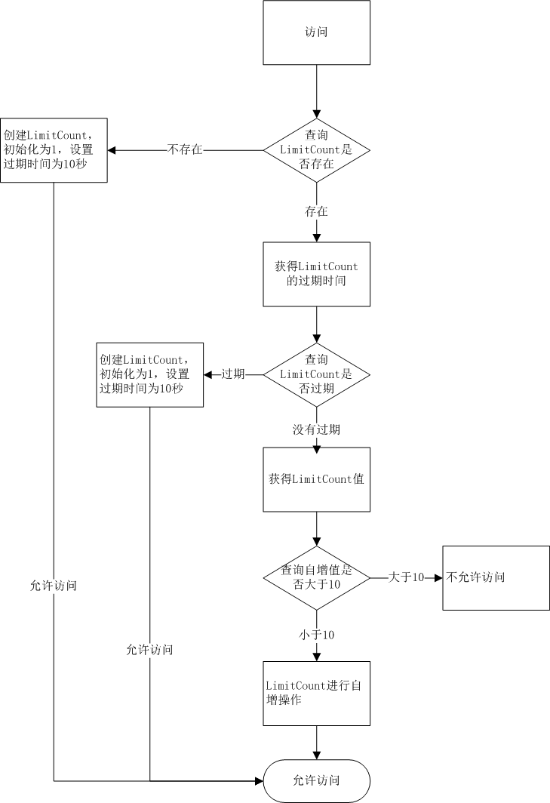

# Table of Contents

* [概述](#概述)
  * [架构](#架构)
  * [秒杀流程](#秒杀流程)
  * [数据库表设计](#数据库表设计)
* [基础功能](#基础功能)
  * [result结果集封装](#result结果集封装)
  * [redis通用缓存Key封装](#redis通用缓存key封装)
  * [明文密码两次MD5处理](#明文密码两次md5处理)
    * [第一次的目的](#第一次的目的)
    * [第二次的目的](#第二次的目的)
  * [全局异常处理器](#全局异常处理器)
    * [异常抛出的流程](#异常抛出的流程)
    * [全局异常处理器处理思路：](#全局异常处理器处理思路：)
    * [实现](#实现)
  * [分布式Session](#分布式session)
* [超卖](#超卖)
  * [现象](#现象)
  * [原因](#原因)
  * [解决库存为负数](#解决库存为负数)
  * [解决重复下单](#解决重复下单)
* [性能优化](#性能优化)
  * [架构层面](#架构层面)
  * [网站本地项目层面](#网站本地项目层面)
    * [前端页面静态化](#前端页面静态化)
    * [缓存技术](#缓存技术)
    * [消息队列](#消息队列)
    * [数据库优化](#数据库优化)
* [安全](#安全)
  * [秒杀接口地址隐藏](#秒杀接口地址隐藏)
  * [redis限流](#redis限流)
  * [数学公式验证码](#数学公式验证码)
* [参考资料](#参考资料)


[TOC]

# 概述

## 架构

秒杀系统为电商系统的定时在线抢购活动，类似淘宝双11。该系统采用**分布式系统架构**，基于**SSM框架**开发秒杀业务后台系统，使用**Redis缓存、消息队列**以及其他性能优化手段提高秒杀系统的性能，拥有“**高并发、分布式、安全、负载均衡**”等特性。


## 秒杀流程 


## 数据库表设计

商品表	秒杀商品表
订单表	秒杀订单表

如果直接在商品表里面添加一个字段表明是否是秒杀商品，会让商品表难以维护

# 基础功能

## result结果集封装

暴露接口，而不是直接去创建对象，面向接口编程，进行解耦合

由于错误有多种原因，所以使用CodeMsg封装code，msg

```java
return Result.success("hello");
return new Result<String>(50010,"success","hello"); //耦合度太高，硬编码
```

```java
public class Result<T> {
	private int code;
	private String msg;
	private T data;
	//construtor
	public static <T> Result<T> success(T data) {
		return new Result<T>(data);
	}
	public static <T> Result<T> error(CodeMsg cm) {
		return new Result<T>(cm);
	}
	//get-set
}
```

```java
public class CodeMsg {
	private int code;
	private String msg;
    //construtor
	public static CodeMsg SUCCESS=new CodeMsg(0,"success");
	public static CodeMsg SERVER_ERROR=new CodeMsg(500100,"服务端异常");
    //get-set
}
```

## redis通用缓存Key封装

[电商系统，Redis做缓存时===>通用缓存key的封装](https://blog.csdn.net/tiankong_12345/article/details/86651613)

采用**字符串**的数据类型，但是不同模块的key可能会相互影响，所以应该设计这样的key "UserKey:id1"，"OrderKey:id1"

**模板模式：接口+抽象类+具体实现**

**优点**

具体细节步骤实现定义在子类中，子类定义详细处理算法是不会改变算法整体结构
**代码复用**的基本技术，在数据库设计中尤为重要
存在一种反向的控制结构，通过一个父类调用其子类的操作，通过子类对父类进行扩展增加新的行为，符合“**开闭原则**”

**缺点**　

每个不同的实现都需要定义一个子类，会导致类的个数增加，系统更加庞大

接口

```java
public interface KeyPrefix {
	public int expireSeconds() ;
	public String getPrefix() ;
}
```

**抽象类**

```java
public abstract class BasePrefix implements KeyPrefix{
	private int expireSeconds;
	private String prefix;
	public BasePrefix(int expireSeconds,String prefix) {
		this.expireSeconds=expireSeconds;
		this.prefix=prefix;
	}
	public BasePrefix(String prefix) {
		this(0, prefix);
	}
	public int expireSeconds() {
		return expireSeconds;
	}
    //具体的方法，也就是模板，不管什么样的key都是通过这种模式进行拼接
	public String getPrefix() {
		String className=getClass().getSimpleName();
		return className+":"+prefix;
	}
}
```

**具体实现类**

```java
public class UserKey extends BasePrefix{
    //子类实现的具体方法，传入不同的属性
	private UserKey(String prefix) {
		super(prefix);
	}
	public static UserKey getById=new UserKey("id");
	public static UserKey getByName=new UserKey("name");
}
```

**service**

```java
public <T> T get(KeyPrefix keyPrefix,String key,Class<T> clazz) {
    Jedis jedis=null;  
    try {
        jedis=jedisPool.getResource();
        //生成真正的key
        String realKey=keyPrefix.getPrefix()+key;
        String string=jedis.get(realKey);
        T t=stringtoBean(string,clazz);
        return t;
    } finally {
        returnToPool(jedis);
    }
}
```

**controller**

```java
@RequestMapping("/redis/get")
@ResponseBody
public Result<User> redisGet(){
    User v1=redisService.get(UserKey.getById,""+1,User.class);
    return Result.success(v1);
}
```

## 明文密码两次MD5处理

[两次MD5加密设计](<https://blog.csdn.net/weixin_38035852/article/details/81052431>)

两次MD5
1.用户端：PASS=MD5（明文+固定Salt）
2.服务端：PASS=MD5（用户输入+随机Salt）

### 第一次的目的

第一次 （在前端加密，客户端）：密码加密是（明文密码+固定盐值）生成md5用于传输，目的，由于http是明文传输，当输入密码若直接发送服务端验证，此时被截取将直接获取到明文密码，获取用户信息。

加盐值是为了混淆密码，原则就是明文密码不能在网络上传输。

### 第二次的目的

第二次：在服务端再次加密，当获取到前端发送来的密码后。通过MD5（密码+随机盐值）再次生成密码后存入数据库。防止数据库被盗的情况下，通过md5反查，查获用户密码。方法是盐值会在用户登陆的时候随机生成，并存在数据库中，这个时候就会获取到。

第二次的目的：
黑客若是同时黑掉数据库，通过解析前端js文件，知道如果md5加密的过程，就知道此时用户的密码。但是此时我们要是在后端加入随机盐值和传输密码的md5组合，黑客是无法知道通过后端密码加密过程的，从而无法知道密码。

## 全局异常处理器

[springBoot配置全局异常处理器](<https://blog.csdn.net/Lei_Da_Gou/article/details/80481846>)

[WEB 项目中的全局异常处理](https://www.cnblogs.com/lhblogs/p/7489246.html)

### 异常抛出的流程

　　在web 项目中，遇到异常一般有两种处理方式：try.....catch....；throw

　　通常情况下我们用try.....catch.... 对异常进行捕捉处理，可是在实际项目中随时的进行异常捕捉，会造成代码重复和繁杂，我们希望代码中只有业务相关的操作，所有的异常我们单独设立一个类来处理它。

​		首先，我们在可能发生异常的方法，全部throw出来，**即dao抛给service、service给controller、controller抛给前端控制器；然后由前端控制器调用 全局异常处理器  对异常进行统一处理**

### 全局异常处理器处理思路：

　　　　首先解析出异常类型；

　　　　　　如果该 异常类型是系统 自定义的异常，直接取出异常信息，在错误页面展示

　　　　　　如果该 异常类型不是系统 自定义的异常，构造一个自定义的异常类型（信息为“未知错误”）（应为一般业务异常我们并不希望被用户知道，防止代码泄露，造成不安全）

　　　　　　自定义异常一般是业务异常，这个异常的信息应该告知客户，系统异常一般是代码异常，一般写日志

### 实现

**定义全局异常类，继承RuntimeException，包装CodeMsg，然后全局异常处理器会捕获全局异常，捕获异常之后给客户端返回一个result，这个result包装了错误信息**

**自定义的全局异常类**

```java
public class GlobalException extends RuntimeException{
	private static final long serialVersionUID = 1L;
	private CodeMsg cm;
	public GlobalException(CodeMsg cm) {
		super(cm.toString());
		this.cm = cm;
    }
	public CodeMsg getCm() {
		return cm;
	}
}
```

**全局异常处理器**

类似controller，拦截Exception类型的异常，并给前端返回Result

使用@ControllerAdvice，@ExceptionHandler

```java
@ControllerAdvice
@ResponseBody
public class GlobalExceptionHandler {
	@ExceptionHandler(value=Exception.class)
	public Result<String> exceptionHandler(HttpServletRequest request, Exception e){
		e.printStackTrace();
		if(e instanceof GlobalException) {
			GlobalException ex = (GlobalException)e;
			return Result.error(ex.getCm());
		}else if(e instanceof BindException) {
			BindException ex = (BindException)e;
			List<ObjectError> errors = ex.getAllErrors();
			ObjectError error = errors.get(0);
			String msg = error.getDefaultMessage();
			return Result.error(CodeMsg.BIND_ERROR.fillArgs(msg));
		}else {
			return Result.error(CodeMsg.SERVER_ERROR);
		}
	}
}
```

## 分布式Session

[基于Redis实现分布式Session](<https://blog.csdn.net/fanrenxiang/article/details/81738634>)

使用Redis作为session存储容器，登录时将session信息存储至cookie客户端，同时服务端将session信息存至redis缓存，双重保障，接下来的接口调用直接可以获取到cookie中的token信息作为参数传递进来即可，如果发现token为空，则再从redis中获取，如果两者都为空，则说明session已过期。

```java
private static String redisKey = "user:session";
//登录成功后生成并保存token
public boolean login(HttpServletResponse response, User user) {
    // 验证用户身份
    User user = userService.check(……);
    //  salt值建议做成可配置化
    String salt = "";
    String token = DigestUtils.md5Hex(user.getName() + salt);   //这里token作为用户信息唯一标识
    addCookie(response, token);
    return true;
}

//添加至redis和cookie
private void addCookie(HttpServletResponse response, String token) {
    redisTemplate.opsForValue().set(redisKey, token, 366, TimeUnit.DAYS);//放入缓存
    Cookie cookie = new Cookie("token", token);
    cookie.setMaxAge(3600 * 24 * 366);   //和Redis缓存失效时间一致
    cookie.setPath("/");
    response.addCookie(cookie);
}

//获取已登录的用户信息
public String getByToken(HttpServletResponse response) {
    String userinfo = redisTemplate.opsForValue().get(redisKey);
    //延长session有效期，过期时间=最后一次使用+失效时间，cookie可以不延长
    if (StringUtils.isNotEmpty(userinfo)) {
        addCookie(response, userinfo);
    }
    return userinfo;
}
```

# 超卖

[超卖现象及解决](<https://blog.csdn.net/weixin_38035852/article/details/81174802>)

[用分布式锁来防止库存超卖，但是是每秒上千订单的高并发场景，如何对分布式锁进行高并发优化来应对这个场景？](<https://blog.csdn.net/u010391342/article/details/84372342>)

## 现象

1.不同用户在读请求的时候，发现商品库存足够，然后**同时发起请求**，进行秒杀操作，减库存，导致库存减为负数。

2.同一个用户在有库存的时候，连续发出多个请求，两个请求同时存在，于是生成多个订单。（**重复下单问题**）

## 原因

```sql
update miaosha_goods set stock_count = stock_count - 1 where goods_id = #{goodsId} and stock_count >0
```

1、数据库底层的**写操作和读操作可以同时进行**，虽然写操作默认带有隐式锁（即对同一数据不能同时进行写操作）但是读操作默认是不带锁的，所以当用户1去修改库存的时候，用户2依然可以都到库存为1，所以出现了超卖现象。

2、先Select 剩余量 from 表，再update为什么有问题

select是共享锁，update是排它锁，共享锁不能解决并发问题

## 解决库存为负数

**分布式锁**

[Redis分布式锁实现秒杀业务(乐观锁、悲观锁)](https://www.cnblogs.com/jasonZh/p/9522772.html)

**锁优化**

将库存进行分段，使用分段锁，当段内库存不足，自动释放锁，切换到下一个库存分段中。

**乐观锁**

**悲观锁**

先select * from A for update， 根据查出来的信息，再进行update

但是问题来了，如果该商品很热门并发量很高那么效率就会大大的下降，怎么解决？

解决方案：

我们可以有条件有选择的在读操作上加锁，比如可以对库存做一个判断，当库存小于一个量时开始加锁，让购买者排队，这样一来就解决了超卖现象。

**消息队列**

将多线程变为单线程读写

## 解决重复下单

将userId和商品Id 加上唯一索引，可以解决这种情况。插入失败。

# 性能优化

[**阿里云服务器 如何处理网站高并发流量问题？（含教程）**](https://yq.aliyun.com/articles/696140)

[如何解决秒杀的性能问题和超卖的讨论](https://www.cnblogs.com/billyxp/p/3701124.html)

## 架构层面

1、硬件升级

2、负载均衡

3、服务器集群

4、分布式结构

## 网站本地项目层面

### 前端页面静态化

客户端缓存静态页面，通过ajax异步发送请求到服务端，服务端返回json数据，然后客户端进行渲染

### 缓存技术

1、对象缓存：用户信息缓存

2、库存的缓存

通过redis预减库存，如果库存小于0，则不同访问数据库

还可以阻挡多余的请求透穿到DB，起到一个保护的作用，因为秒杀的商品有限，比如10个，让1万个请求区访问DB是	没有意义的，因为最多也就只能10个请求下单成功。

**redis 预减成功，DB扣减库存失败怎么办**

需要使用分布式事务，使用TCC补偿事务的方式，try阶段预减库存，comfirm阶段下单，cancle阶段增加库存

如果不使用分布式事务进行回滚，则会出现商品库存减掉了，但是没有订单生成

**为什么redis数量会减少为负数**

```java
//预见库存
long stock = redisService.decr(GoodsKey.getMiaoshaGoodsStock,""+goodsId) ;
if(stock <0){
    localOverMap.put(goodsId, true);
    return Result.error(CodeMsg.MIAO_SHA_OVER);
}
//假如redis的数量为1,这个时候同时过来100个请求，大家一起执行decr数量就会减少成-99这个是正常的,进行优化后改变了sql写法和内存写法则不会出现上述问题
```

3、本地缓存：当库存小于0时，本地使用一个map做内存标记，key为商品ID，value为true，代表商品已经卖完，无需进行后面的秒杀流程。

### 消息队列

 请求先入队缓冲，异步下单，增强用户体验
 请求出队，生成订单，减少库存
 客户端定时轮询检查是否秒杀成功 

### 数据库优化

**数据库的优化总结为如下三点**

​	1、数据库分表技术

​	2、数据库读写分离

​	3、表建立相应的索引

```
1.在秒杀一类的场景里面，因为数据量亿万级所有即使有的有缓存有的时候也是扛不住的，不可避免的透穿到DB
 所有在写一些sql的时候就要注意：
 1.一定要避免全表扫描，如果扫一张大表的数据就会造成慢查询，导致数据的连接池直接塞满,导致事故
 首先考虑在where和order by 设计的列上建立索引
 例如： 1. where 子句中对字段进行 null 值判断 . 
       2. 应尽量避免在 where 子句中使用!=或<>操作符 
       3. 应尽量避免在 where 子句中使用 or 来连接条件
       4. in 和 not in 也要慎用，否则会导致全表扫描( 如果索引 会优先走索引 不会导致全表扫描 
        字段上建了索引后，使用in不会全表扫描，而用not in 会全表扫描 低版本的mysql是两种情况都会全表扫描。
        5.5版本后以修。而且在优化大表连接查询的时候，有一个方法就是将join操作拆分为in查询)
       5. select id from t where name like '%abc%' 或者
       6.select id from t where name like '%abc' 或者
       7. 若要提高效率，可以考虑全文检索。 
       8.而select id from t where name like 'abc%' 才用到索引 慢查询一般在测试环境不容易复现
       9.应尽量避免在 where 子句中对字段进行表达式操作 where num/2  num=100*2
 2.合理的使用索引  索引并不是越多越好，使用不当会造成性能开销
 3.尽量避免大事务操作，提高系统并发能力
 4.尽量避免象客户端返回大量数据，如果返回则要考虑是否需求合理，实在不得已则需要在设计一波了！！！！！
```

# 安全

[接口地址隐藏](<https://blog.csdn.net/ldb987/article/details/86743312>)

## 秒杀接口地址隐藏

思路：秒杀开始之前，先去请求接口获取秒杀地址

1.接口改造，带上PathVariable参数
2.添加生成地址的接口
3.秒杀收到请求，先验证PathVariable

如果用户提前知道了接口地址，就可能出现狂刷接口的现象，为了防止这种情况发生，最好的方法就是不让用户获取到秒杀接口地址。有一种实现方式就是隐藏接口地址，所谓的隐藏是指，秒杀地址每次都是不同的，而且在地点秒杀按钮后，会先调用后端接口获取一个pathId，然后传回前端，拼接在秒杀接口上，再请求秒杀接口地址，这样每次点击按钮后，才会生成真正的秒杀接口地址。

好处：可以防止接口泄露，或者用户提前知道接口，而出现的狂刷接口的现象。

实现：
1、点击秒杀按钮，先请求一个后端服务，生成随机数(进行MD5加密)作为pathId，存入缓冲，设置过期时间，然后传回前端。

```javascript
// 调用后台接口获取秒杀接口的入口地址
function getMiaoshaPath(){
	var goodsId = ("#goodsId").val();
	g_showLoading();
	.ajax({
		url:"/miaosha/path",
		type:"GET",
		data:{
			goodsId:goodsId,
			verifyCode:$("#verifyCode").val()
		},
		success:function(data){
			if(data.code == 0){
                //相当于是产生的uuid（获取到的秒杀接口的入口地址）
				var path = data.data;
				doMiaosha(path);
			}else{
				layer.msg(data.msg);
			}
		},
		error:function(){
			layer.msg("客户端请求有误");
		}
	});
}
```

后端方法

```java
@RequestMapping(value="/path", method=RequestMethod.GET)
    @ResponseBody
    public Result<String> getMiaoshaPath(HttpServletRequest request, MiaoshaUser user,
    		@RequestParam("goodsId")long goodsId,
    		@RequestParam(value="verifyCode", defaultValue="0")int verifyCode
    		) {
    	if(user == null) {
    		return Result.error(CodeMsg.SESSION_ERROR);
    	}
    	String str = MD5Util.md5(UUIDUtil.uuid()+"123456");
    	redisService.set(MiaoshaKey.getMiaoshaPath, ""+user.getId() + "_"+ goodsId, str);
    	return Result.success(str);
    }
```

2、获得pathId后，前端用这个pathId拼接在秒杀接口上作为参数。

//秒杀的时候，需要向服务端传递参数

```javascript
function doMiaosha(path){
	$.ajax({
        //进行秒杀
		url:"/miaosha/"+path+"/do_miaosha",
		type:"POST",
		data:{
			goodsId:$("#goodsId").val()
		},
		success:function(data){
			if(data.code == 0){
				//window.location.href="/order_detail.htm?orderId="+data.data.id;
				getMiaoshaResult($("#goodsId").val());
			}else{
				layer.msg(data.msg);
			}
		},
		error:function(){
			layer.msg("客户端请求有误");
		}
	});
}
```

3、后端接收到这个pathId，并且与缓冲的pathId比较，如果

```java
@RequestMapping(value="/{path}/do_miaosha", method=RequestMethod.POST)
@ResponseBody
public Result<Integer> miaosha(Model model,MiaoshaUser user,
                               @RequestParam("goodsId")long goodsId,
                               @PathVariable("path") String path) {
    model.addAttribute("user", user);
    if(user == null) {
        return Result.error(CodeMsg.SESSION_ERROR);
    }
    //验证path------------------------------------------
    String pathOld = redisService.get(MiaoshaKey.getMiaoshaPath, ""+user.getId() + "_"+ goodsId, String.class);
    //如果通过比较，进行秒杀逻辑
    if(!path.equals(pathOld)){
        //如果通不过，抛出业务异常，非法请求
        return Result.error(CodeMsg.REQUEST_ILLEGAL);
    }
    //验证path------------------------------------------
    //内存标记，减少redis访问
    boolean over = localOverMap.get(goodsId);
    if(over) {
        return Result.error(CodeMsg.MIAO_SHA_OVER);
    }
    //预减库存
    long stock = redisService.decr(GoodsKey.getMiaoshaGoodsStock, ""+goodsId);//10
    if(stock < 0) {
        localOverMap.put(goodsId, true);
        return Result.error(CodeMsg.MIAO_SHA_OVER);
    }
    //判断是否已经秒杀到了
    MiaoshaOrder order = orderService.getMiaoshaOrderByUserIdGoodsId(user.getId(), goodsId);
    if(order != null) {
        return Result.error(CodeMsg.REPEATE_MIAOSHA);
    }
    //入队
    MiaoshaMessage mm = new MiaoshaMessage();
    mm.setUser(user);
    mm.setGoodsId(goodsId);
    sender.sendMiaoshaMessage(mm);
    return Result.success(0);//排队中
}
```

## redis限流

[Redis实现限流功能](https://www.cnblogs.com/use-D/p/9544903.html)

key为URL+userId，值为访问的次数，存活时间为限流规定的时间



## 数学公式验证码

思路：点击秒杀之前，先输入验证码，分散用户的请求

1.添加生成验证码的接口
2.在获取秒杀路径的时候，验证验证码
3.ScriptEngine使用

# 参考资料

[秒杀系统架构分析与实战](https://www.cnblogs.com/andy-zhou/p/5364136.html)

[秒杀系统视频笔记](https://blog.csdn.net/qq_41305266?t=1)

[秒杀抢购系统优化思路详解](https://www.jianshu.com/p/b5807229ac5c)